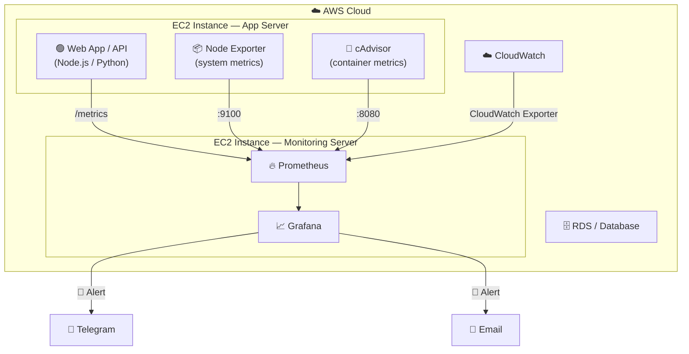
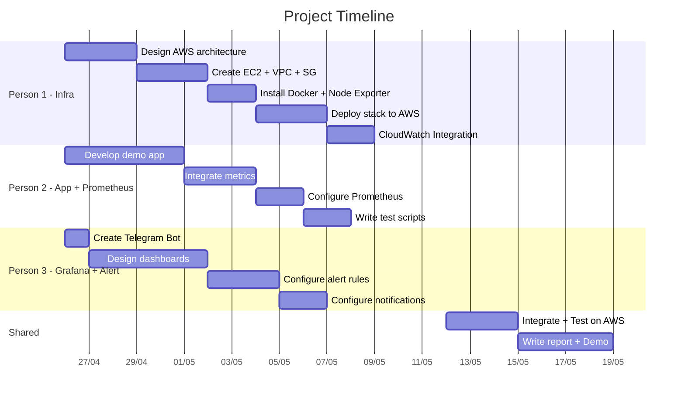

# 📊 Task Assignment — Resource & Performance Monitoring System on AWS

## Project Overview

Build a resource and performance monitoring system for an application on the AWS Cloud environment, using the stack: **Prometheus + Grafana + Alerting (Telegram/Slack/Email)**.

### Comparison with current sample source code

| Aspect | Current sample source code | AWS Project (Expanded) |
|-----------|---------------------------|----------------------|
| Environment | Docker local | **AWS Cloud** (EC2, ECS, or EKS) |
| Demo App | 1 simple Node.js app | **Multiple services** (web app, API, database...) |
| Source metrics | prom-client + cAdvisor | **CloudWatch + Node Exporter + cAdvisor + prom-client** |
| Alert channels | Telegram only | **Telegram + Email/Slack** (multiple channels) |
| Dashboard | 1 dashboard with 5 panels | **Multiple detailed dashboards** |
| Infrastructure | docker-compose | **Terraform/CloudFormation + Docker Compose** |

---

## Proposed Architecture



---

## 👥 3-Person Task Assignment

---

### 🧑‍💻 Person 1 — AWS Infrastructure & Deployment (Infrastructure)

> **Role:** Build the entire infrastructure on AWS, ensuring services can run and communicate with each other.

#### Specific tasks:

- [ ] **Design AWS architecture**
  - Draw the architecture diagram
  - Decide whether to use EC2 or ECS/EKS
  - Design VPC, Subnet, Security Groups

- [ ] **Provision AWS infrastructure**
  - Create EC2 instances (at least 2: app server + monitoring server)
  - Configure Security Groups (open ports: 8081, 9090, 9100, 4000, 8080)
  - Create an RDS instance (if using a database)
  - Configure IAM roles for CloudWatch access

- [ ] **Deploy the application to AWS**
  - Install Docker & Docker Compose on EC2
  - Deploy the entire stack to the cloud
  - Configure domain/public IP to access Grafana

- [ ] **Configure Node Exporter**
  - Install Node Exporter on the EC2 app server
  - Expose system metrics (CPU, RAM, Disk, Network)

- [ ] **CloudWatch Integration** (Advanced)
  - Install CloudWatch Exporter or YACE
  - Collect AWS-native metrics (EC2 CPU Credit, EBS IOPS, RDS connections...)

- [ ] **Write documentation**
  - Deployment guide
  - Architecture diagram

#### Skills required:
`AWS EC2` `VPC` `Security Groups` `Docker` `Linux` `SSH`

#### Responsible files:
```text
infrastructure/
├── terraform/          # or create manually via the Console
│   ├── main.tf
│   ├── variables.tf
│   └── outputs.tf
├── docker-compose.yml  # Main compose file
├── node-exporter/
│   └── docker-compose.node-exporter.yml
└── README-deploy.md    # Deployment guide
```

---

### 🧑‍💻 Person 2 — Demo Application & Prometheus (App + Metrics Collection)

> **Role:** Build a more realistic demo application and configure Prometheus to collect metrics.

#### Specific tasks:

- [ ] **Develop demo application**
  - Build an app more complex than the sample (e.g., REST API with CRUD)
  - Integrate a database (MySQL/PostgreSQL on RDS)
  - Add practical endpoints: `/api/users`, `/api/products`...

- [ ] **Integrate Metrics into App** (using `prom-client` or equivalent)
  - **Counter**: total requests, total errors, total DB queries
  - **Histogram**: HTTP response time, DB query time
  - **Gauge**: current active connections, queue size
  - Categorize metrics by labels: `method`, `route`, `status_code`

- [ ] **Configure Prometheus**
  - Write `prometheus.yml` with multiple scrape targets:
    - Node.js App (`:8081/metrics`)
    - Node Exporter (`:9100/metrics`)
    - cAdvisor (`:8080/metrics`)
    - CloudWatch Exporter (if available)
  - Configure scrape interval, evaluation interval
  - Configure retention (how long to keep data)

- [ ] **Write test scripts**
  - Traffic simulation script (locust, k6, or curl shell script)
  - Mass error simulation script (stress test)

- [ ] **Write documentation**
  - Describe API endpoints
  - Explain the created metrics

#### Skills required:
`Node.js/Python` `Express/FastAPI` `prom-client` `Basic PromQL` `Database`

#### Responsible files:
```text
app/
├── Dockerfile
├── package.json
├── src/
│   ├── index.js           # Entry point
│   ├── metrics.js         # Define all custom metrics
│   ├── routes/            # API routes
│   └── middleware/        # Timing middleware
├── load-test/
│   └── test-script.sh     # Traffic simulation script
└── README-app.md

prometheus/
├── prometheus.yml         # Scrape targets configuration
└── alert-rules.yml        # (Optional) Prometheus alert rules
```

---

### 🧑‍💻 Person 3 — Grafana Dashboard & Alerting (Visualization + Notification)

> **Role:** Design visually appealing dashboards, configure alert rules, and connect Telegram/Email notifications.

#### Specific tasks:

- [ ] **Design Grafana Dashboards** (provisioning via JSON/YAML)
  - **Dashboard 1 — Application Overview**: request rate, error rate, response time (p50/p95/p99), throughput
  - **Dashboard 2 — System Resources**: CPU, RAM, Disk I/O, Network I/O (from Node Exporter)
  - **Dashboard 3 — Container Metrics**: container CPU, memory, restart count (from cAdvisor)
  - **Dashboard 4 — Database** (if any): connections, query time, slow queries

- [ ] **Configure Data Sources**
  - Connect Grafana → Prometheus (provisioning file)

- [ ] **Design Alert Rules**
  - 🚨 **High Error Rate**: `rate(http_errors_total[5m]) > 0.1`
  - 🔥 **High CPU**: `100 - (avg(rate(node_cpu_seconds_total{mode="idle"}[5m])) * 100) > 80`
  - 💾 **High Memory**: `(1 - node_memory_MemAvailable_bytes / node_memory_MemTotal_bytes) * 100 > 85`
  - 💽 **Disk Almost Full**: `(1 - node_filesystem_avail_bytes / node_filesystem_size_bytes) * 100 > 90`
  - 🐌 **High Latency**: `histogram_quantile(0.95, ...) > 2`

- [ ] **Configure Contact Points & Notifications**
  - Telegram Bot: create a bot, get the token, configure the chat ID
  - Email (optional): configure SMTP
  - Design clear and visually appealing message templates

- [ ] **Configure Notification Policies**
  - Categorize alerts by severity (critical → Telegram + Email, warning → Telegram only)
  - Group alerts to avoid spam

- [ ] **Write documentation**
  - Explain dashboard panels
  - Explain alert rules & thresholds
  - Telegram Bot configuration guide

#### Skills required:
`Grafana UI/Provisioning` `PromQL` `Telegram Bot API` `JSON/YAML`

#### Responsible files:
```text
grafana/
└── provisioning/
    ├── datasources/
    │   └── datasource.yml
    ├── dashboards/
    │   ├── dashboard_provider.yml
    │   ├── app_overview.json        # Dashboard 1
    │   ├── system_resources.json    # Dashboard 2
    │   ├── container_metrics.json   # Dashboard 3
    │   └── database.json            # Dashboard 4
    └── alerting/
        ├── rules.yaml               # All alert rules
        ├── contact_points.yaml      # Telegram + Email
        └── policies.yaml            # Routing policies
```

---

## 📅 Proposed Timeline (3-4 weeks)



---

## 🔗 Coordination Points Among the 3 People

| Coordination | People involved | Content |
|----------|----------------|----------|
| App running on EC2 | **1 ↔ 2** | Person 2 provides Dockerfile, Person 1 deploys to EC2 |
| Prometheus targets | **1 ↔ 2** | Person 1 provides IP/hostname, Person 2 updates `prometheus.yml` |
| Grafana datasource | **1 ↔ 3** | Person 1 provides Prometheus URL, Person 3 configures datasource |
| What are the metric names? | **2 ↔ 3** | Person 2 defines metrics, Person 3 writes PromQL queries for the dashboard |
| End-to-end testing | **1 + 2 + 3** | All 3 test together: trigger error → dashboard displays it → Telegram receives alert |

> [!IMPORTANT]
> **Crucial convention:** Person 2 must agree on metric names with Person 3 **before coding**, for example:
> - `app_http_requests_total` (not `http_total_requests`)
> - `app_http_request_duration_seconds` (not `response_time`)
> 
> Use [Prometheus naming conventions](https://prometheus.io/docs/practices/naming/).

---

## 💡 Advanced Suggestions (Bonus Points)

- **Auto Scaling Monitoring**: Monitor when an AWS Auto Scaling Group adds/removes instances
- **Cost Monitoring**: Collect AWS billing metrics
- **Log Aggregation**: Add Loki + Promtail to collect logs (in addition to metrics)
- **Uptime Monitoring**: Use Blackbox Exporter to check endpoint health (up/down status)
- **Grafana Variables**: Allow dynamic selection of instances and time ranges on the dashboard